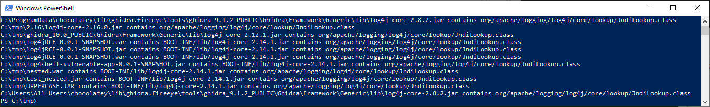
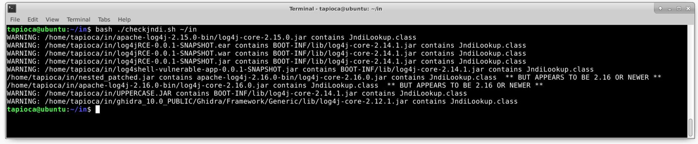

# CVE-2021-44228_scanner
Applications that are vulnerable to the log4j [CVE-2021-44228](https://nvd.nist.gov/vuln/detail/CVE-2021-44228) issue may be detectable by scanning jar, war, and ear files to search for the presence of `JndiLookup.class`.

Depending on the platform that you are investigating, the PowerShell or the Python3 script may make more sense to run.  In both cases, the optional argument is the top-level directory that you would like to use to begin your search.

Any file discovered is worth investigation to determine if the application using it is vulnerable. For any `JndiLookup.class` that is present, log4j commonly includes the version in the jar file name. For example, a hit on `log4j-core-2.14.1.jar` would be indicative of a vulnerable application. Alternatively, `log4j-core-2.16.jar` may also produce a hit because the JndiLookup code is still present in the 2.16 version of log4j, but it is disabled by default.  See [VU#930724](https://www.kb.cert.org/vuls/id/930724) for more details.

For example, here is an invocation of the PowerShell version of the scanner:


Similarly, here is an invocation of the Python3 version:


Finally, here is an invocation of the Bash version:

Note that the Bash version of this script will by design limit scans to a single filesystem.

Let's look at the first hit on our Windows scan execution:
```
WARNING: C:\tmp\2.15\log4j-core-2.15.0.jar contains org/apache/logging/log4j/core/lookup/JndiLookup.class
```

Based on the jar name, this is a library from log4j 2.15. While this version of log4j fixes CVE-2021-44228, it still contained a flaw that is outlined as CVE-2021-45046. The impact of [CVE-2021-45046](https://nvd.nist.gov/vuln/detail/CVE-2021-45046) is a denial of service for only certain Java applications that use log4j 2.15. For Java applications that use log4j versions prior to 2.15 and that also fit the prerequisites for CVE-2021-45046 applying, the impact is RCE.

Let's look at the second hit:
```
C:\tmp\2.16\log4j-core-2.16.0.jar contains org/apache/logging/log4j/core/lookup/JndiLookup.class ** BUT APPEARS TO BE 2.16 OR NEWER **
```
This jar file contains a 2.16 version of log4j, which is not vulnerable to CVE-2021-44228. This result is reported for information purposes, which shows that a vendor has patched their product.

Let's look at the third hit:
```
WARNING: C:\tmp\ghidra_10.0_PUBLIC\Ghidra\Framework\Generic\lib\log4j-core-2.12.1.jar contains org/apache/logging/log4j/core/lookup/JndiLookup.class
```

Here we can see that Ghidra uses log4j version 2.12.1, and as such we should assume it to be vulnerable. And indeed, Ghidra versions before 10.1 are [vulnerable to CVE-2021-44228](https://github.com/NationalSecurityAgency/ghidra/releases/tag/Ghidra_10.1_build).

You should investigate any hits reported by either of these scripts, and confirm that either the log4j version is indeed the fixed 2.16 version, or reach out to your software vendor to obtain a fixed version of the software. Alternatively, [VU#930724](https://www.kb.cert.org/vuls/id/930724) has information about how `JndiLookup.class` can be removed from vulnerable jar files.
